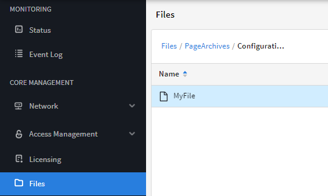
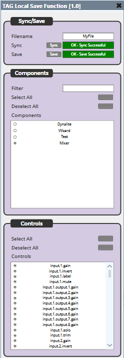
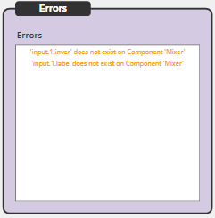

# Local Save Function

This is a Q-SYS Plugin for saving and recalling named component configurations in a JSON file on the Core's Media directory.

> Bug reports and feature requests should be sent to Jason Foord (jf@tag.com.au).

## How do I get set up?

See [Q-SYS Online Help File - Plugins](https://q-syshelp.qsc.com/#Schematic_Library/plugins.htm)

## File Location

A new directory is created called 'Configuration Files' in the 'PageArchives' directory.

Saved files are stored in this directory as '***filename***.json'.



## JSON File Preview

The JSON file stores controls in the following structure:

> This example is for a named component 'Mixer' with controls 'input.1.gain' and 'input.1.invert' selected.

```javascript
{
    "Mixer": [
        {
            "Control": "input.1.gain",
            "String": "0dB"
        },
        {
            "Control": "input.1.invert",
            "String": "normal"
        },
    ]
}
```



## Sync/Save

#### Filename

The filename to save/recall the json file.

#### Sync

Sync the selected controls from a json file with the configured filename.

#### Save

Save the selected controls to a json file with the configured filename.

## Components

#### Filter

Filter the components via a string.match method.

#### Select All

Select all components in the listbox.

#### Deselect All

Deselect all components in the listbox.

#### Components

Displays the filtered components. Components can be selected in a toggle fashion.

> When a component is selected, it's controls will appear in the 'Controls' listbox for manual selection.

> When a component is deselected, it's controls will be unselected.

> When another component is selected, the previously selected component's control will still be included in the save until that component is deselected.

## Controls

#### Select All

Select all controls in the listbox.

#### Deselect All

Deselect all controls in the listbox.

#### Controls

Displays the controls of the selected component. Controls can be selected in a toggle fashion.

> Selected controls will be included in the file save.

## Errors


#### Errors

Any errors that occurred during the last sync.

> Errors occur when the componenet doesn't exist in the design, when the control doesn't exist on the component, or is the JSON file is invalid. Errors are non-blocking.